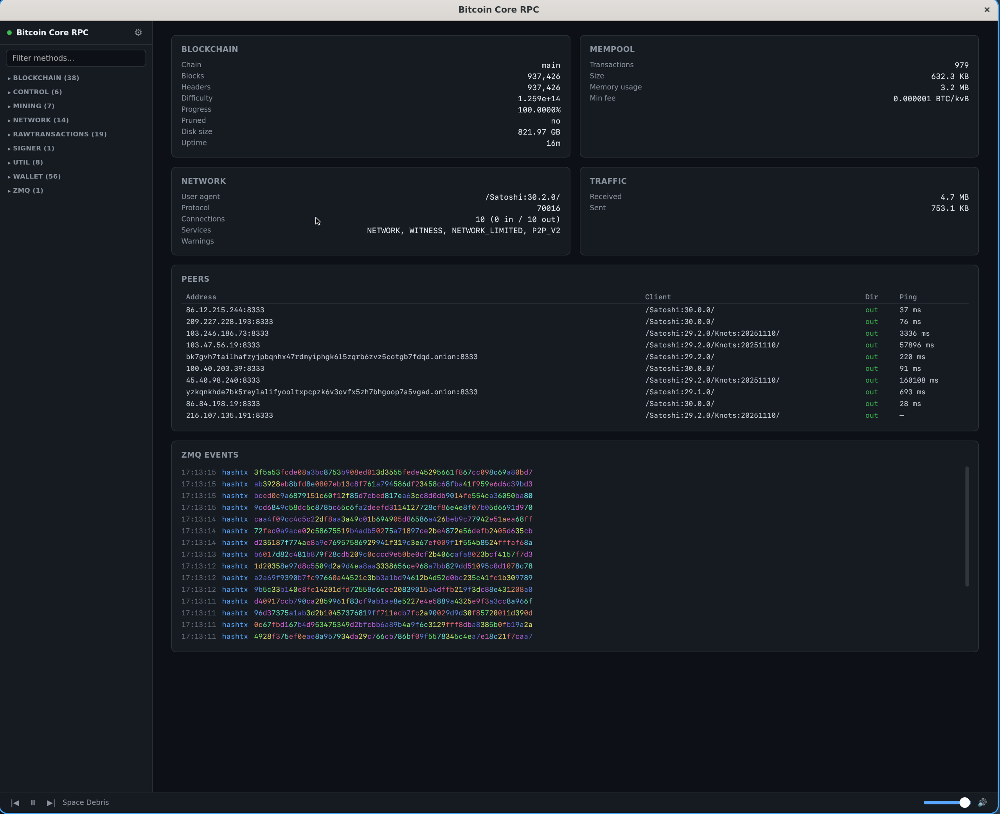

# bitcoin-rpc-web

A lightweight desktop GUI for interacting with Bitcoin Core's JSON-RPC interface. Built with [wry](https://github.com/nicoreeves/nicoreeves.github.io) (WebView) and a vanilla HTML/JS frontend.



## Features

- Browse all RPC methods from Bitcoin Core's OpenRPC schema, grouped by category
  - This is currently baked in for ~ v30.99 functionality, based on [this branch](https://github.com/bitcoin/bitcoin/compare/master...willcl-ark:bitcoin:json-rpc-schema)
- Fill in parameters with type-aware form fields and execute calls
- Multi-wallet support with a wallet selector dropdown
- Collapsible config panel with optional password persistence
- Live dashboard with blockchain, mempool, network, traffic, and peer cards
  - Clickable peer rows with full `getpeerinfo` detail view
  - Color-coded peer direction (green outbound, orange inbound)
- Live ZMQ event feed showing `hashblock` and `hashtx` notifications with hue-mapped hex byte coloring
- RPC address validation — blocks non-local RPC connections by default (see [Remote RPC](#remote-rpc))
- Built-in tracker music player for extra fun while crafting transactions

## Usage

### With Nix

```
nix run
```

### With Cargo

Requires system dependencies for WebView:

- **Linux:** GTK 3, WebKitGTK 4.1, libsoup 3
- **macOS:** No extra dependencies

```
cargo run --release
```

Configure the RPC connection (URL, user, password) via the gear icon in the sidebar. The app connects to `http://127.0.0.1:8332` by default.

### Build Without Audio

Audio is enabled by default behind the `audio` feature. To build without the music player and audio dependencies:

```
cargo run --release --no-default-features
```

With audio enabled (default), Linux additionally needs ALSA development libraries for `rodio`.

### ZMQ

To enable the live ZMQ event feed, Bitcoin Core must be started with ZMQ notification endpoints. Add the following to `bitcoin.conf`:

```
zmqpubhashblock=tcp://0.0.0.0:29000
zmqpubhashtx=tcp://0.0.0.0:29000
```

Use `127.0.0.1` instead of `0.0.0.0` if you only need local access. Then enter the ZMQ address (e.g. `tcp://127.0.0.1:29000`) in the config panel and press Connect. The ZMQ Events card will appear on the dashboard once messages arrive.

Enable debug logging to stdout with:

```
RUST_LOG=bitcoin_rpc_web=debug cargo run --release
```

### Remote RPC

RPC credentials are sent via HTTP Basic Auth in the clear. By default, the app only allows connections to local and private network addresses (localhost, `127.0.0.0/8`, `10.0.0.0/8`, `172.16.0.0/12`, `192.168.0.0/16`, and `100.64.0.0/10` for WireGuard/Tailscale). Attempting to connect to a public IP will be blocked with an error message.

If you're connecting to a remote node over a trusted tunnel or don't have funds at risk, you can bypass this check:

```
DANGER_INSECURE_RPC=1 cargo run --release
```

## Music

Tracker tunes sourced from [The Mod Archive](https://modarchive.org). Playback uses [xmrs](https://crates.io/crates/xmrs) and [rodio](https://crates.io/crates/rodio).
